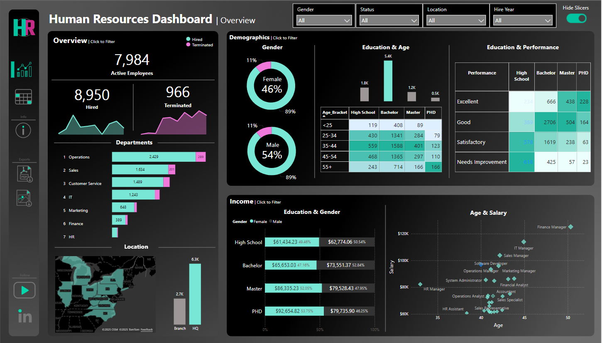

# Human Resources Dashboard

An interactive **Power BI HR dashboard** analyzing workforce metrics, demographics, and performance, designed to provide both high-level insights and employee-level details.

---

## 📊 Dashboard Pages Overview

### 1️⃣ Overview
High-level HR insights:
- Total Active Employees, Hires, Terminations (line charts + KPIs)
- Departmental breakdown
- Location map & Headquarters vs Branch comparison
- Male vs Female distribution
- Education & Performance heatmap
- Education vs Gender comparison
- Age & Salary correlation
- 4 slicers with toggle/on-off button.

### 2️⃣ Employee List View
Detailed employee-level matrix:
- Columns: Employee ID, Name, Gender, Age, Education, Department, Job Title, City, State, Salary, Status, Tenure
- Full slicer panel for filtering (toggleable)

---

## 🎥 Dashboard Walkthrough (Video)
Interactive walkthrough of all features and pages:

https://github.com/user-attachments/assets/44762ab0-c209-43a9-963b-b8b2f547068f

---

## 🛠 Tools & Technologies
- **Power BI Desktop**
- DAX (KPIs, correlations, comparisons)
- Power Query (data cleaning & transformation)
- Data modeling & relationships

---

## 📁 Project File
- Power BI file: `Human_Resources_Dashboard.pbix`

---

## 🚀 How to Use
1. Download the `.pbix` file  
2. Open in **Power BI Desktop**
3. Explore using slicers, toggle panel, and page navigation

---

## 📌 Notes
- Data is for demonstration purposes  
- Dashboard emphasizes clarity, interactivity, and usability

## 🙌 Credits
This project was fully implemented by me (**Muhammad Zubair**) as part of my portfolio work.

Special credit goes to **Baraa Khatib Salkini**, also known as **Data With Baraa**, who designed the original project concept and made it freely available.
